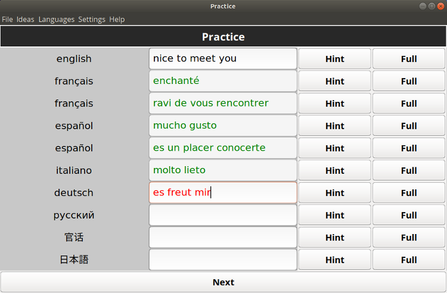

# Babilonia

Babilonia is an innovative tool for language enthusiasts who want to grow and strengthen 
their vocabulary in foreign languages.

Unlike traditionnal methods, Babilonia lets you practice multiple languages *at the same time*! 
:heart_eyes:

## Features

- Lets you memorize a *maximum* amount of words in a *minimum* amount of time
- Contains clever tricks to help you remember as you type
- Keeps track of how many words you know in each language
- Uses a novel method based on universal ideas
- Allows you to practice multiple languages all at once!

## What's the deal?

### Practicing

The core component of Babilonia is its practice feature.

An idea shows up in the language(s) of your choice, and you get to practice it in all other languages.

An idea could be a thing, an expression or even a whole sentence. You're the boss!

### Powerful help

As you're typing, Babilonia helps you by coloring letters in green if you're on the right 
track or red if not.

By helping you recall the word by yourself without having to look for the answer, 
your brain will more easily remember it the next time. :wink:

### More powerful help

Press the Hint button to have a letter revealed to you, which may well spark a sudden insight
in your mind. Again, that helps your brain create neural pathways it would otherwise not if the answer 
was given out in full to you the first time!

Of course, if you really don't know, you can always just press the Full button.

### Different spellings

You can have as many spellings as you want for any given word. Simply separate them by slashes, 
and they will all be accepted.

For example, if you have

- "苹果 / pín guǒ / pin guo" -> whether you type "苹果", "pín guǒ" or "pin guo", they will all be valid!

### Optional elements

You can also add optional elements around words by putting them in parentheses.

For example, if you have
- "(der) Apfel" -> both "der Apfel" and "Apfel" will be valid!

This feature is very useful to provide context too, for example play (guitar) as opposed to play (soccer).

## Picking which languages to practice

Even though you *could* practice all the languages you know at the same time, it doesn't mean you always *have* to! 
Maybe you'd  like to focus on some languages.

You can choose which languages you would like to study in Languages -> Set Practice Languages.

Words whose languages are set to "practice" will be hidden when practicing,
and others will show. Also, ideas which do not have any words with languages set to "practice" will
not show up when practicing. 

## The goal

How you dashboard might look one day! :grinning:

## Database

The database is stored in the database.db file. You can make backups of that file and at
any point in the future, overwrite it with any other version and it will be restored.

Upon installation, you get an empty database, which you can then fill with ideas and words
that matter most to you.

As of now, there are no pre-defined databases to download, because there are as many different 
ways of using Babilonia as there are users.

However, it will be considered in future releases to have starter databases, or even allow users 
to share theirs!

## I'm convinced, how do I install this thing?

### Prerequisites

- Maven
- JDK 11

### Installing

    git clone https://github.com/emilepharand/Babilonia
    cd Babilonia
    mvn package
    cp target/Babilonia.jar database.db /your/install/path/
    java -jar /your/install/path/Babilonia.jar

## License

This project is licensed under the terms of the MIT license.

## Can I contribute?

Of course! Feel free to open an issue or make a pull request.

## Any questions?

Do not hesitate to contact me at emile.pharand.github@gmail.com :smile:
 
 
 
People often say that motivation doesn't last. Well, neither does bathing — that's why we recommend it daily.
\- Zig Ziglar